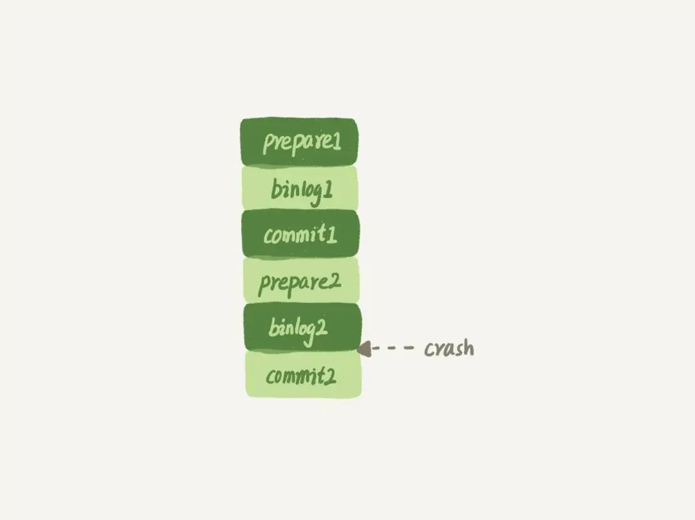

# redo log

> 注意：redo log 文件是Innodb引擎特有的，不属于MySQL的server层。

如果每一次的更新操作都需要写进磁盘，然后磁盘也要找到对应的那条记录，然后再更新，整个过程IO成本、查找成本都很高。为了解决这个问题，MySQL的设计者就用了类似酒店掌柜粉板的思路来提升更新效率。

MySQL里经常说到的WAL技术，WAL的全称是Write-Ahead Logging，它的关键点就是先写日志，再写磁盘。  

具体来说，当有一条记录需要更新的时候，InnoDB引擎就会先把记录写到`redo log`里面，并更新内存，这个时候更新就算完成了。同时，InnoDB引擎会在适当的时候，将这个操作记录更新到磁盘里面，而这个更新往往是在系统比较空闲的时候做。

InnoDB的`redo log`是固定大小的，比如可以配置为一组4个文件，每个文件的大小是1GB，那么`redo log`总共就可以记录4GB的操作。从头开始写，写到末尾就又回到开头循环写，如下面这个图所示。


`write pos`是当前记录的位置，一边写一边后移，写到第3号文件末尾后就回到0号文件开头。`checkpoint`是当前要擦除的位置，也是往后推移并且循环的，擦除记录前要把记录更新到数据文件。

`write pos`和`checkpoint`之间的是`redo log`还空着的部分，可以用来记录新的操作。如果`write pos`追上`checkpoint`，表示`redo log`满了，这时候不能再执行新的更新，得停下来先擦掉一些记录（即刷脏页，flush。[MySQL中的脏页以及刷脏页](https://github.com/ProgrammerGoGo/document/blob/main/MySQL/MySQL%E4%B8%AD%E7%9A%84%E8%84%8F%E9%A1%B5%E6%98%AF%E4%BB%80%E4%B9%88%EF%BC%9F.md)），把`checkpoint`推进一下。

有了`redo log`，InnoDB就可以保证即使数据库发生异常重启，之前提交的记录都不会丢失，这个能力称为`crash-safe`。

# binlog

> binglog 是MySQL的server层的日志文件。

因为最开始MySQL里并没有InnoDB引擎。MySQL自带的引擎是MyISAM，但是MyISAM没有crash-safe的能力，`binlog`日志只能用于归档。而InnoDB是另一个公司以插件形式引入MySQL的，既然只依靠`binlog`是没有`crash-safe`能力的，所以InnoDB使用另外一套日志系统——也就是`redo log`来实现`crash-safe`能力。

> [binlog的两种格式](https://learn.lianglianglee.com/%e4%b8%93%e6%a0%8f/MySQL%e5%ae%9e%e6%88%9845%e8%ae%b2/24%20%20MySQL%e6%98%af%e6%80%8e%e4%b9%88%e4%bf%9d%e8%af%81%e4%b8%bb%e5%a4%87%e4%b8%80%e8%87%b4%e7%9a%84%ef%bc%9f.md)

# redo log 和 binlog 日志的不同点：
`redo log` 和 `binlog` 日志的不同点：

* `redo log` 是InnoDB引擎特有的；`binlog` 是MySQL的Server层实现的，所有引擎都可以使用。

* `redo log` 是物理日志，记录的是“在某个数据页上做了什么修改”；`binlog` 是逻辑日志，记录的是这个语句的原始逻辑，比如“给ID=2这一行的c字段加1 ”。

* `redo log` 是循环写的，空间固定会用完；`binlog` 是可以追加写入的。“追加写”是指 `binlog` 文件写到一定大小后会切换到下一个，并不会覆盖以前的日志。

# binlog和redolog的写入机制

> [23 MySQL是怎么保证数据不丢的？](https://learn.lianglianglee.com/%e4%b8%93%e6%a0%8f/MySQL%e5%ae%9e%e6%88%9845%e8%ae%b2/23%20%20MySQL%e6%98%af%e6%80%8e%e4%b9%88%e4%bf%9d%e8%af%81%e6%95%b0%e6%8d%ae%e4%b8%8d%e4%b8%a2%e7%9a%84%ef%bc%9f.md)中详细描述了binlog和redolog的写入机制


# 问题

> [15 答疑文章（一）：日志和索引相关问题](https://learn.lianglianglee.com/%e4%b8%93%e6%a0%8f/MySQL%e5%ae%9e%e6%88%9845%e8%ae%b2/15%20%20%e7%ad%94%e7%96%91%e6%96%87%e7%ab%a0%ef%bc%88%e4%b8%80%ef%bc%89%ef%bc%9a%e6%97%a5%e5%bf%97%e5%92%8c%e7%b4%a2%e5%bc%95%e7%9b%b8%e5%85%b3%e9%97%ae%e9%a2%98.md)

# 问题1：在两阶段提交的不同时刻，MySQL异常重启会出现什么现象？

> 崩溃恢复时的判断规则：
> 1. 如果`redo log`里面的事务是完整的，也就是已经有了`commit`标识，则直接提交；
> 2. 如果`redo log`里面的事务只有完整的`prepare`，则判断对应的事务`binlog`是否存在并完整：  
>     a. 如果是，则提交事务；  
>     b. 否则，回滚事务。  

## 时刻1（属于 2(b) 情况）
如果在写入`redo log`处于`prepare`阶段之后、写`binlog`之前，发生了崩溃（crash），由于此时`binlog`还没写，`redo log`也还没提交，所以崩溃恢复的时候，这个事务会回滚。这时候，`binlog`还没写，所以也不会传到备库。

## 时刻2（属于 2(a) 情况）
如果在`binlog`写完，`redo log`还没`commit`前发生crash，崩溃恢复过程中事务会被提交。

# 问题2：MySQL怎么知道binlog是完整的?

一个事务的binlog是有完整格式的：

* statement格式的binlog，最后会有COMMIT；
* row格式的binlog，最后会有一个XID event。

另外，在MySQL 5.6.2版本以后，还引入了binlog-checksum参数，用来验证binlog内容的正确性。对于binlog日志由于磁盘原因，可能会在日志中间出错的情况，MySQL可以通过校验checksum的结果来发现。所以，MySQL还是有办法验证事务binlog的完整性的。

# 问题3：redo log 和 binlog是怎么关联起来的?

它们有一个共同的数据字段，叫XID。崩溃恢复的时候，会按顺序扫描`redo log`：

* 如果碰到既有prepare、又有commit的`redo log`，就直接提交；
* 如果碰到只有parepare、而没有commit的`redo log`，就拿着XID去binlog找对应的事务。

# 问题4：处于prepare阶段的redo log加上完整binlog，重启就能恢复，MySQL为什么要这么设计?

这个问题与“数据与备份的一致性”有关。

在`binlog`写完以后MySQL发生崩溃，这时候`binlog`已经写入了，之后就会被从库（或者用这个`binlog`恢复出来的库）使用。

所以，在主库上也要提交这个事务。采用这个策略，主库和备库的数据就保证了一致性。

# 问题5：如果这样的话，为什么还要两阶段提交呢？干脆先redo log写完，再写binlog。崩溃恢复的时候，必须得两个日志都完整才可以。是不是一样的逻辑？

其实，两阶段提交是经典的分布式系统问题，并不是MySQL独有的。

如果必须要举一个场景，来说明这么做的必要性的话，那就是事务的持久性问题。

对于InnoDB引擎来说，如果`redo log`提交完成了，事务就不能回滚（如果这还允许回滚，就可能覆盖掉别的事务的更新）。而如果`redo log`直接提交，然后`binlog`写入的时候失败，InnoDB又回滚不了，数据和`binlog`日志又不一致了。

两阶段提交就是为了给所有人一个机会，当每个人都说“我ok”的时候，再一起提交。

# 问题6：可以只保留binlog，不要redo log么？

只用`binlog`来实现崩溃恢复的流程图如下。



这样的流程下，`binlog`还是不能支持崩溃恢复的，因为`binlog`没有能力恢复“数据页”。

如果在图中标的位置，也就是binlog2写完了，但是整个事务还没有`commit`的时候，MySQL发生了crash。

重启后，引擎内部事务2会回滚，然后应用binlog2可以补回来；但是对于事务1来说，系统已经认为提交完成了，不会再应用一次binlog1。

但是，InnoDB引擎使用的是WAL技术，执行事务的时候，写完内存和日志，事务就算完成了。如果之后崩溃，要依赖于日志来恢复数据页。

也就是说在图中这个位置发生崩溃的话，事务1也是可能丢失了的，而且是数据页级的丢失。此时，`binlog`里面并没有记录 **数据页的更新细节** ，是补不回来的。

你如果要说，那我优化一下`binlog`的内容，让它来记录数据页的更改可以吗？但，这其实就是又做了一个`redo log`出来。

所以，至少现在的`binlog`能力，还不能支持崩溃恢复。

# 问题7：可以只保留redo log，不要binlog么？

如果只从崩溃恢复的角度来讲是可以的。你可以把`binlog`关掉，这样就没有两阶段提交了，但系统依然是`crash-safe`的。

但是，因为`binlog`有着`redo log`无法替代的功能。

* 一个是归档。`redo log`是循环写，写到末尾是要回到开头继续写的。这样历史日志没法保留，`redo log`也就起不到归档的作用。

* 一个就是MySQL系统依赖于`binlog`。`binlog`作为MySQL一开始就有的功能，被用在了很多地方。其中，MySQL系统高可用的基础，就是`binlog`复制。

还有很多公司有异构系统（比如一些数据分析系统），这些系统就靠消费MySQL的`binlog`来更新自己的数据。关掉`binlog`的话，这些下游系统就没法输入了。

# 问题8：redo log一般设置多大？

`redo log`太小的话，会导致很快就被写满，然后不得不强行刷`redo log`，这样WAL机制的能力就发挥不出来了。

所以，如果是现在常见的几个TB的磁盘的话，就不要太小气了，直接将`redo log`设置为4个文件、每个文件1GB吧。

# 问题9：正常运行中的实例，数据写入后的最终落盘，是从redo log更新过来的还是从buffer pool更新过来的呢？

这里涉及到了，“`redo log`里面到底是什么”的问题。

实际上，`redo log`并没有记录数据页的完整数据，所以它并没有能力自己去更新磁盘数据页，也就不存在“数据最终落盘，是由`redo log`更新过去”的情况。

如果是正常运行的实例的话，数据页被修改以后，跟磁盘的数据页不一致，称为`脏页`。最终数据落盘，就是把内存中的数据页写盘。这个过程，甚至与`redo log`毫无关系。

在崩溃恢复场景中，InnoDB如果判断到一个数据页可能在崩溃恢复的时候丢失了更新，就会将它读到内存，然后让`redo log`更新内存内容。更新完成后，内存页变成`脏页`，就回到了第一种情况的状态。

# 问题10：redo log buffer是什么？是先修改内存，还是先写redo log文件？

在一个事务的更新过程中，日志是要写多次的。比如下面这个事务：

```sql
begin;
insert into t1 ...
insert into t2 ...
commit;
```

这个事务要往两个表中插入记录，插入数据的过程中，生成的日志都得先保存起来，但又不能在还没commit的时候就直接写到`redo log`文件里。

所以，`redo log buffer`就是一块内存，用来先存`redo`日志的。也就是说，在执行第一个`insert`的时候，数据的内存被修改了，`redo log buffer`也写入了日志。

但是，真正把日志写到`redo log`文件（文件名是 ib_logfile+数字），是在执行`commit`语句的时候做的。


