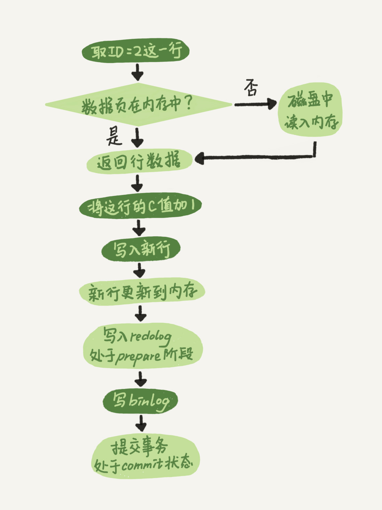

[02讲日志系统：一条SQL更新语句是如何执行的](https://funnylog.gitee.io/mysql45/02%E8%AE%B2%E6%97%A5%E5%BF%97%E7%B3%BB%E7%BB%9F%EF%BC%9A%E4%B8%80%E6%9D%A1SQL%E6%9B%B4%E6%96%B0%E8%AF%AD%E5%8F%A5%E6%98%AF%E5%A6%82%E4%BD%95%E6%89%A7%E8%A1%8C%E7%9A%84.html)

> 先来了解 [redo log和binlog日志分别是什么](https://github.com/ProgrammerGoGo/document/edit/main/MySQL/redo%20log%20%E5%92%8C%20binlog%20%E6%97%A5%E5%BF%97%E5%88%86%E5%88%AB%E6%98%AF%E4%BB%80%E4%B9%88.md)

SQL更新语句执行流程和 [一条SQL查询语句的执行流程](https://github.com/ProgrammerGoGo/document/blob/main/MySQL/%E4%B8%80%E6%9D%A1SQL%E6%9F%A5%E8%AF%A2%E8%AF%AD%E5%8F%A5%E7%9A%84%E6%89%A7%E8%A1%8C%E6%B5%81%E7%A8%8B.md) 相似，不同点主要在“执行器”和“存储引擎”的操作流程上。

要想了解更新语句 `update T set c=c+1 where ID=2;` 的执行流程，需要先了解 [redo log和binlog日志分别是什么](https://github.com/ProgrammerGoGo/document/blob/main/MySQL/redo%20log%20%E5%92%8C%20binlog%20%E6%97%A5%E5%BF%97%E5%88%86%E5%88%AB%E6%98%AF%E4%BB%80%E4%B9%88.md) 。

有了对这两个日志的概念性理解，我们再来看执行器和InnoDB引擎在执行这个简单的update语句时的内部流程。

1、执行器先找引擎取ID=2这一行。ID是主键，引擎直接用索引树搜索找到这一行。如果ID=2这一行数据所在的 **数据页** 本来就在存储引擎的内存中，就直接返回给执行器；否则，需要先从磁盘读入存储引擎内存，然后再返回。

2、执行器拿到引擎给的行数据，把这个值加上1，比如原来是N，现在就是N+1，得到新的一行数据，再调用引擎接口写入这行新数据。

3、引擎将这行新数据更新到存储引擎内存中，同时将这个更新操作记录到 `redo log` 里面，此时 `redo log` 处于prepare状态。然后告知执行器执行完成了，随时可以提交事务。

4、执行器生成这个操作的 `binlog`，并把 `binlog` 写入磁盘。

5、执行器调用引擎的提交事务接口，引擎把刚刚写入的 `redo log` 改成提交（commit）状态，更新完成。

> mysql脏页和干净页：  
> 当内存数据页和磁盘数据页上的内容不一致时，我们称这个内存页为 **脏页**；  
> 内存数据写入磁盘后（术语就是flush），内存页上的数据和磁盘页上的数据就一致了，我们称这个内存页为干净页。  
> 不管是脏页 还是 干净页 ，他们都在内存中。

这里我给出这个update语句的执行流程图，图中浅色框表示是在InnoDB内部执行的，深色框表示是在执行器中执行的。

# 问题1：在两阶段提交的不同时刻，MySQL异常重启会出现什么现象？

## 时刻1
如果在写入`redo log`处于`prepare`阶段之后、写`binlog`之前，发生了崩溃（crash），由于此时`binlog`还没写，`redo log`也还没提交，所以崩溃恢复的时候，这个事务会回滚。这时候，`binlog`还没写，所以也不会传到备库。

## 时刻2
如果在`binlog`写完，`redo log`还没`commit`前发生crash，那崩溃恢复的时候MySQL会怎么处理？

崩溃恢复时的判断规则。

* 如果`redo log`里面的事务是完整的，也就是已经有了`commit`标识，则直接提交；

* 如果`redo log`里面的事务只有完整的`prepare`，则判断对应的事务`binlog`是否存在并完整：  
a. 如果是，则提交事务；  
b. 否则，回滚事务。  

这里，时刻B发生crash对应的就是2(a)的情况，崩溃恢复过程中事务会被提交。

