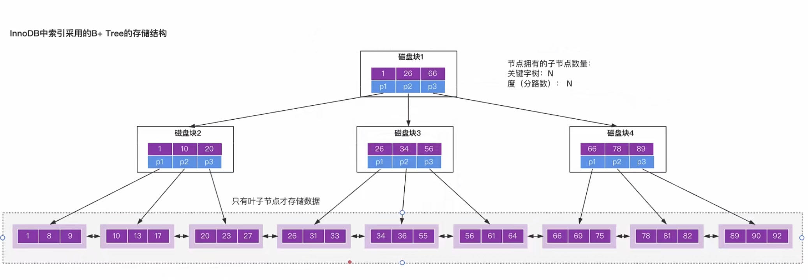

首先 B+树 是一颗多路平衡树，它的特点是：通过减少非叶子结点的存储数据量以及增加树的分支数量，降低树的高度从而减少磁盘的IO次数来提高数据检索性能。

InnoDB 存储引擎最小储存单元是 **页** ，一页大小就是 16k。 B+树叶子存的是数据，内部节点存的是键值+指针。索引组织表通过非叶子节点的 **二分查找法** 以及 **指针** 确定数据在哪个页中，进而再去数据页中找到需要的数据;   

> 注意：
> * b+树中，一个节点就是一个页，非叶子节点的页存储的是索引值+指针，叶子节点存储的是数据。
> * 一个指针指向一个存放记录的页

* 单个非叶子节点指针数的计算：  
我们假设主键 ID 为 bigint 类型，长度为 8 字节 (int 类型占 32 位，即 4 字节)，而指针大小在InnoDB 源码中设置为 6 字节，所以一个非叶子节点存储的指针数最多为 16k/(8B+6B)=16*1024B/14B=1170  

* 单个叶子节点存储的记录行数计算：  
如果一行记录的数据大小为 1k，那么 单个叶子节点可以存的记录数=16k/1k=16

假设 B+树的高度为 2 的话，即有一个根结点和若干个叶子结点。这棵 B+树的 存放 **总记录数 = 根结点指针数 * 单个叶子节点存储的记录行数**。 
总记录数 = 1170 * 16

高度为3的B+树可以存放多少数据？  
总记录数 = 1170 * 1170 * 16

高度为n的B+树可以存放多少数据？ 
总记录数 = 1170^(n-1) * 16 

> 因此，一棵高度为 2 的 B+树，能存放 1170 * 16=18720 条这样的数据记录。同理一棵高度为 3 的 B+树，能存放 1170 *1170 *16 =21902400，也就是说，可以存放两千万左右的记录。B+树高度一般为 1-3 层，已经满足千万级别的数据存储。

